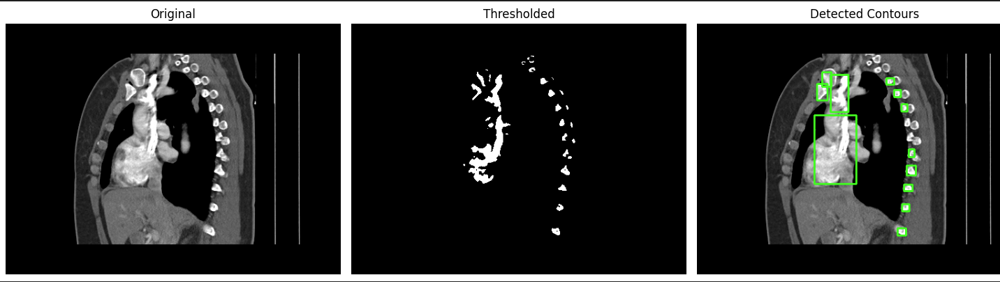

# Contour Detection in Medical Images

This demo shows how to detect and draw bounding boxes around anatomical structures in medical-style images using OpenCV.\
Existing image is from:\
"Case courtesy of Adeniyi Olorunfemi Fagbohun, <a href="https://radiopaedia.org/?lang=us">Radiopaedia.org</a>. From the case <a href="https://radiopaedia.org/cases/210008?lang=us">rID: 210008</a>"

## Features
- Grayscale conversion
- Image smoothing
- Thresholding
- Contour detection with bounding boxes

## Libraries used
- OpenCV
- NumPy
- Matplotlib

## How to run
- clone the repo
- (optional) create and activate a virtual environment
- install dependencies

```python
pip install -r requirements.txt
```

- open contour-detection-demo folder in vs code or jupyter
- run the code


## Sample Output


---